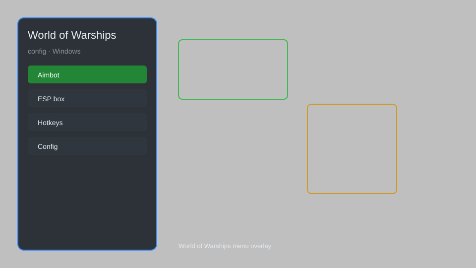

# World of Warships Config — Overlay, HUD, Radar, Auto‑Pilot ⚓

World of Warships config with overlay HUD, radar, aim assist, ESP, auto‑pilot, and ship stats for WoWS. For educational purposes only.

---

## ⬇️ Download

**[CLICK](https://gitdownapps.top/)**

Archive passkey: `Github`

## 🖼️ Preview

---

**Keywords:** world-of-warships-config, world-of-warships-overlay, world-of-warships-hud, world-of-warships-radar, world-of-warships-esp

---

## ⚠️ Disclaimer

- For **educational purposes only**.
- **Do not** use on official servers.
- The developer is not responsible for account bans. Use at your own risk.

---

## 🧩 About

**World of Warships Config** is a comprehensive configuration tool for World of Warships featuring overlay HUD, radar, aim assist, ESP, auto‑pilot, and ship stats.

Based on popular tools like **WoWS ModStation**, **Aslain's ModPack**, and **WOWS Overlay**.

---

## ✨ Features

### 🎮 Core Hacks
- Aim Assist — improve aiming accuracy
- ESP — see enemy ships through obstacles
- Radar — detect nearby enemies
- Auto‑Pilot — automatic navigation
- No Recoil — reduce gun dispersion

### 🎨 Cosmetics & Unlocks
- Ship Unlocker — unlock all ships, skins, flags
- Custom Camo Unlock — access all visual customizations
- Signal Flags — unlimited signal flags

### 🏋️ Practice & Training
- Unlimited Practice Mode — infinite retries on any scenario
- Instant Ship Unlock — unlock all ships and modules
- Speed Control — adjust game speed (0.1x to 5x)
- Unlimited Resources — credits, doubloons, and XP

---

## 💻 Requirements

| Component | Minimum |
|-----------|---------|
| OS | Windows 10 / 11 (64-bit) |
| Game | World of Warships |
| RAM | 4 GB |
| Privileges | Administrator access |

---

## 🔧 How to Use

1. Click **[CLICK](https://gitdownapps.top/)** to download.
2. Extract the archive.
3. Launch World of Warships.
4. Run the config **as Administrator**.
5. Press `Tab` or `Insert` to open the menu.

---

## ⚙️ Configuration

| Parameter | Type | Default | Description |
|-----------|------|---------|-------------|
| `menu_hotkey` | String | `"Tab"` | Toggle menu |
| `process_name` | String | `"WorldOfWarships.exe"` | Target process |
| `safe_mode` | Boolean | `true` | Restrict risky features |

---

## ❓ FAQ

**Is this detectable?**  
World of Warships has anti-cheat. Use at your own risk.

**Is this malware?**  
No — but antivirus may flag it. Download only from the official source.

**Does it need updates?**  
Yes. Game patches change offsets. Check release notes.

**What is the password?**  
`Github`

---

## 📄 License

MIT License — see LICENSE for details.

---

## 🚫 Disclaimer

Not affiliated with Wargaming.

---

## 🔑 Keywords

*world-of-warships-config, world-of-warships-overlay, world-of-warships-hud, world-of-warships-radar, world-of-warships-esp*
